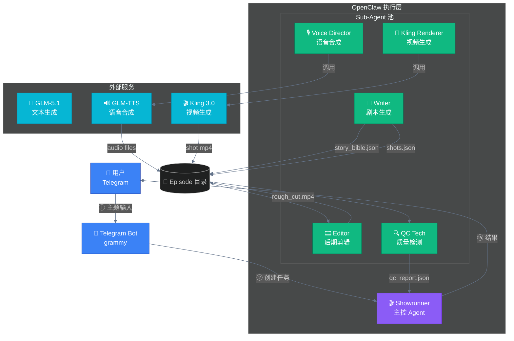
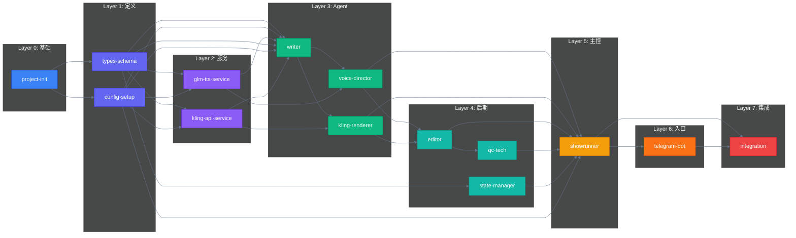
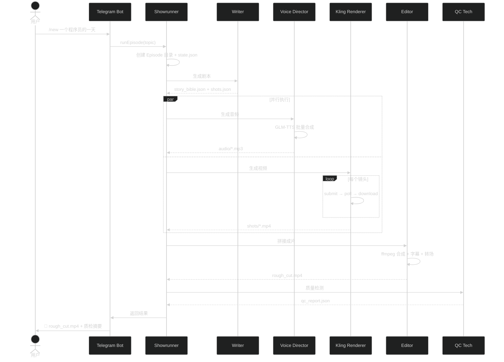
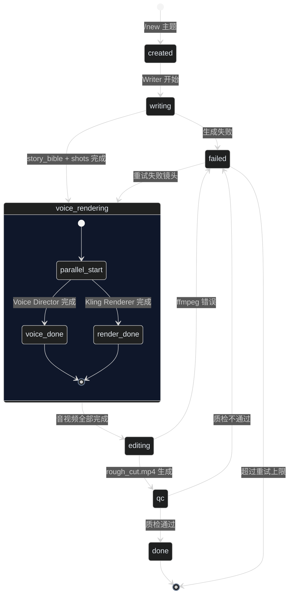

# kais-aigc-movie 架构设计

## 系统架构图

```mermaid
%%{init: {'theme': 'dark', 'themeVariables': {
  'primaryColor': '#3b82f6',
  'primaryTextColor': '#e2e8f0',
  'primaryBorderColor': '#64748b',
  'lineColor': '#64748b',
  'background': '#0f172a'
}}}%%
graph TB
    U[👤 用户<br/>Telegram] -->|① 主题输入| BOT[🤖 Telegram Bot<br/>grammy]
    BOT -->|② 创建任务| SR[🎬 Showrunner<br/>主控 Agent]

    subgraph OpenClaw[OpenClaw 执行层]
        SR
        subgraph Agents[Sub-Agent 池]
            W[📝 Writer<br/>剧本生成]
            V[🎙️ Voice Director<br/>语音合成]
            K[🎥 Kling Renderer<br/>视频生成]
            E[🎞️ Editor<br/>后期剪辑]
            Q[🔍 QC Tech<br/>质量检测]
        end
    end

    subgraph External[外部服务]
        GLM[🧠 GLM-5.1<br/>文本生成]
        TTS[🔊 GLM-TTS<br/>语音合成]
        KLING[🎬 Kling 3.0<br/>视频生成]
    end

    W -->|story_bible.json| FS[(📂 Episode 目录)]
    W -->|shots.json| FS
    V -->|调用| TTS
    TTS -->|audio files| FS
    K -->|调用| KLING
    KLING -->|shot mp4| FS
    FS --> E
    E -->|rough_cut.mp4| FS
    FS --> Q
    Q -->|qc_report.json| SR
    SR -->|⑮ 结果| U

    classDef entry fill:#3b82f6,stroke:#1e40af,color:#fff
    classDef agent fill:#8b5cf6,stroke:#6d28d9,color:#fff
    classDef core fill:#10b981,stroke:#047857,color:#fff
    classDef external fill:#06b6d4,stroke:#0e7490,color:#fff
    classDef done fill:#f97316,stroke:#c2410c,color:#fff

    class U,BOT entry
    class SR agent
    class W,V,K,E,Q core
    class GLM,TTS,KLING external
```

## DAG 执行流程图

```mermaid
%%{init: {'theme': 'dark', 'themeVariables': {
  'primaryColor': '#3b82f6', 'background': '#0f172a',
  'primaryTextColor': '#e2e8f0', 'lineColor': '#64748b'
}}}%%
graph LR
    subgraph L0[Layer 0: 基础]
        P0[project-init]
    end
    subgraph L1[Layer 1: 定义]
        T[types-schema]
        C[config-setup]
    end
    subgraph L2[Layer 2: 服务]
        GT[glm-tts-service]
        KA[kling-api-service]
    end
    subgraph L3[Layer 3: Agent]
        WR[writer]
        VD[voice-director]
        KR[kling-renderer]
    end
    subgraph L4[Layer 4: 后期]
        ED[editor]
        QC[qc-tech]
        SM[state-manager]
    end
    subgraph L5[Layer 5: 主控]
        SR[showrunner]
    end
    subgraph L6[Layer 6: 入口]
        TB[telegram-bot]
    end
    subgraph L7[Layer 7: 集成]
        INT[integration]
    end

    P0 --> T & C
    T & C --> GT & KA
    T & C & GT --> WR
    T & C & KA --> WR
    WR --> VD & KR
    GT --> VD
    KA --> KR
    VD & KR --> ED
    ED --> QC
    T --> SM
    VD & KR & ED & QC & SM --> SR
    C --> SR
    SR --> TB
    SR & TB --> INT

    classDef l0 fill:#3b82f6,stroke:#1e40af,color:#fff
    classDef l1 fill:#6366f1,stroke:#4338ca,color:#fff
    classDef l2 fill:#8b5cf6,stroke:#6d28d9,color:#fff
    classDef l3 fill:#10b981,stroke:#047857,color:#fff
    classDef l4 fill:#14b8a6,stroke:#0d9488,color:#fff
    classDef l5 fill:#f59e0b,stroke:#d97706,color:#fff
    classDef l6 fill:#f97316,stroke:#c2410c,color:#fff
    classDef l7 fill:#ef4444,stroke:#dc2626,color:#fff

    class P0 l0
    class T,C l1
    class GT,KA l2
    class WR,VD,KR l3
    class ED,QC,SM l4
    class SR l5
    class TB l6
    class INT l7
```

## 时序图 — 单集生成流程

```mermaid
%%{init: {'theme': 'dark', 'themeVariables': {
  'primaryColor': '#3b82f6', 'background': '#0f172a',
  'primaryTextColor': '#e2e8f0', 'lineColor': '#64748b'
}}}%%
sequenceDiagram
    actor U as 用户
    participant B as Telegram Bot
    participant SR as Showrunner
    participant W as Writer
    participant V as Voice Director
    participant K as Kling Renderer
    participant E as Editor
    participant Q as QC Tech

    U->>B: /new 一个程序员的一天
    B->>SR: runEpisode(topic)
    SR->>SR: 创建 Episode 目录 + state.json
    SR->>W: 生成剧本
    W-->>SR: story_bible.json + shots.json

    par 并行执行
        SR->>V: 生成音频
        V->>V: GLM-TTS 批量合成
        V-->>SR: audio/*.mp3
    and
        SR->>K: 生成视频
        loop 每个镜头
            K->>K: submit → poll → download
        end
        K-->>SR: shots/*.mp4
    end

    SR->>E: 拼接成片
    E->>E: ffmpeg 合成 + 字幕 + 转场
    E-->>SR: rough_cut.mp4

    SR->>Q: 质量检测
    Q-->>SR: qc_report.json

    SR->>B: 返回结果
    B->>U: 📎 rough_cut.mp4 + 质检摘要
```

## 状态机图

```mermaid
%%{init: {'theme': 'dark', 'themeVariables': {
  'primaryColor': '#3b82f6', 'background': '#0f172a',
  'primaryTextColor': '#e2e8f0', 'lineColor': '#64748b'
}}}%%
stateDiagram-v2
    [*] --> created: /new 主题
    created --> writing: Writer 开始
    writing --> voice_rendering: story_bible + shots 完成

    state voice_rendering {
        [*] --> parallel_start
        parallel_start --> voice_done: Voice Director 完成
        parallel_start --> render_done: Kling Renderer 完成
        voice_done --> [*]
        render_done --> [*]
    }

    voice_rendering --> editing: 音视频全部完成
    editing --> qc: rough_cut.mp4 生成
    qc --> done: 质检通过
    qc --> failed: 质检不通过
    failed --> voice_rendering: 重试失败镜头

    editing --> failed: ffmpeg 错误
    writing --> failed: 生成失败

    done --> [*]
    failed --> [*]: 超过重试上限
```
